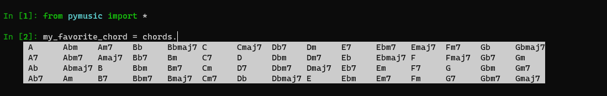
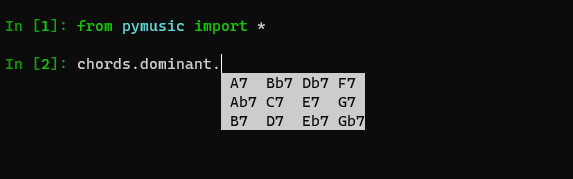
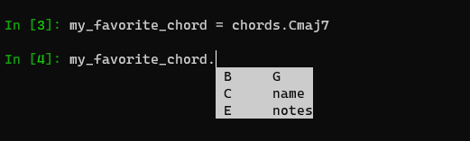

# PyMusic

This is a library that can be used by musicians with
minimal technical knowledge to analyse music.

The main effort of this library is to allow fun usage with IPython's autocomplete.

## Globals

